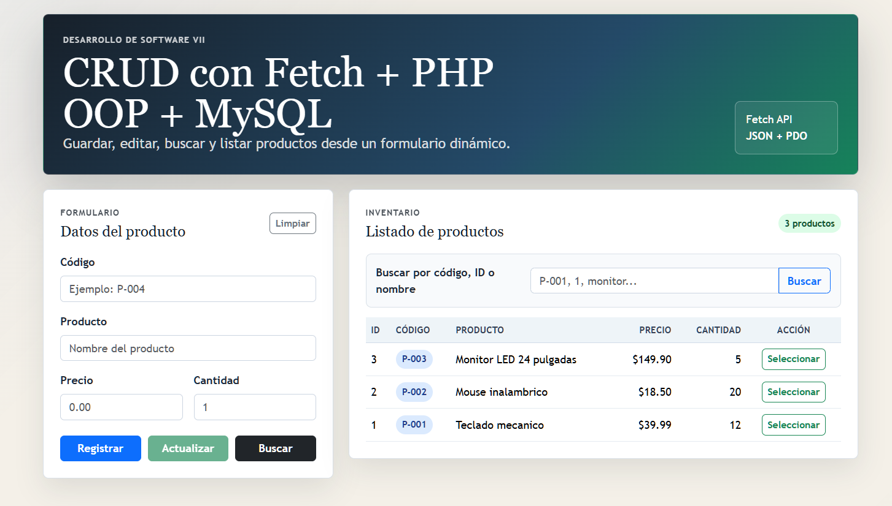
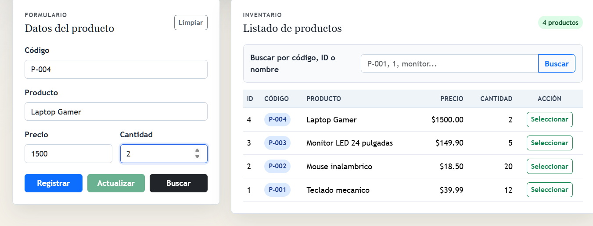
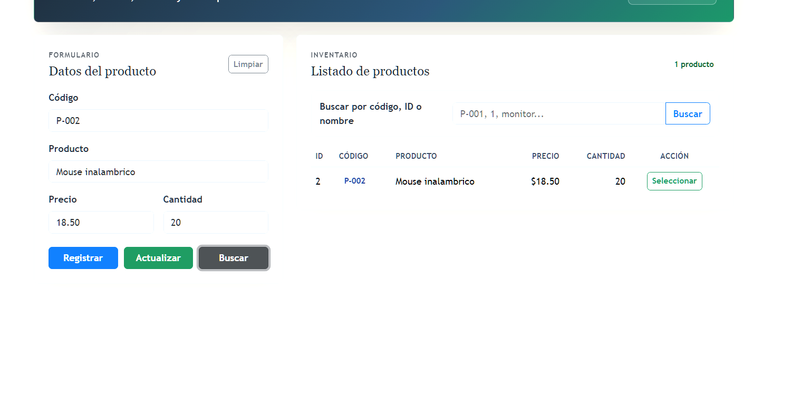
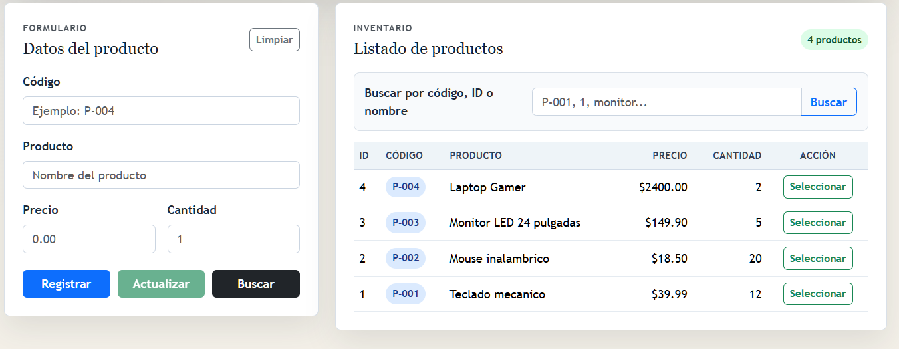

# CRUD con Fetch + PHP OOP + MySQL

Laboratorio universitario de Desarrollo de Software VII para registrar, modificar, buscar y listar productos usando PHP puro orientado a objetos, PDO, MySQL, Fetch API, FormData, Bootstrap y SweetAlert2.


Hecho por André Reboulet y Rubén Dominguez.

Docente : IRINA FONG

Grupo: 1GS131

## Lo que se debe de usar para ejecutar este laboratorio

- XAMPP o WampServer con Apache y MySQL activos.
- PHP 8.0 o superior recomendado.
- Navegador moderno con soporte para Fetch API.

## Instalacion

1. Copie o mantenga la carpeta en el servidor local:
   `htdocs/Software7/Laboratorios/CrudFetch-lab7/crud-fetch-productos`
2. Abra phpMyAdmin o el cliente MySQL de su preferencia.
3. Importe el archivo:
   `database/productosdb.sql`
4. Configure las variables de entorno:
   - Use `.env-example` como guia.
   - Ajuste `.env` segun su instalacion local.
   - No comparta `.env` si contiene credenciales reales.
5. Por defecto el proyecto usa:
   - host: `localhost`
   - base de datos: `productosdb`
   - usuario: `root`
   - contraseña: vacia
6. Abra en el navegador:
   `http://localhost/Software7/Laboratorios/CrudFetch-lab7/crud-fetch-productos/`

## Estructura

```text
crud-fetch-productos/
├── Modelo/
│   ├── conexion.php
│   └── Productos.php
├── assets/
│   ├── css/
│   │   └── styles.css
│   ├── js/
│   │   └── script.js
│   └── img/
│       └── capturas/
├── database/
│   └── productosdb.sql
├── .env
├── .env-example
├── .gitignore
├── registrar.php
├── index.html
└── README.md
```

## Variables de entorno

`Modelo/conexion.php` carga el archivo `.env` sin usar dependencias externas. Si el servidor ya tiene variables definidas, esas variables tienen prioridad.

```env
APP_NAME="CRUD Fetch Productos"
APP_ENV=local
APP_DEBUG=false

DB_HOST=localhost
DB_DATABASE=productosdb
DB_USERNAME=root
DB_PASSWORD=
DB_CHARSET=utf8mb4
```

Mantenga `APP_DEBUG=false` para no exponer detalles internos del servidor en respuestas JSON.

## Funcionalidades

- Guardar productos con validacion en JavaScript y PHP.
- Modificar productos buscados o seleccionados desde la tabla.
- Buscar por ID, codigo o nombre.
- Listar productos dinamicamente sin recargar la pagina.
- Responder siempre con JSON limpio desde `registrar.php`.
- Usar consultas preparadas con PDO para prevenir inyeccion SQL.
- Usar `switch` en PHP y JavaScript para centralizar acciones.

## Acciones del backend

`registrar.php` recibe `FormData` por metodo `POST` con el campo `Accion`.

Acciones disponibles:

- `Guardar`
- `Modificar`
- `Buscar`
- `Listar`

Respuesta base:

```json
{
  "success": true,
  "message": "Producto guardado correctamente.",
  "accion": "Guardar",
  "errors": []
}
```

## Validaciones

- `codigo` obligatorio.
- `producto` obligatorio.
- `precio` obligatorio, numerico y no negativo.
- `cantidad` obligatoria, numerica y no negativa.
- Al guardar, `cantidad` debe ser minimo `1`.
- Al modificar, `cantidad` puede ser `0`.
- `codigo` es unico en la base de datos.

## Capturas de pantalla:

Formulario + listado de productos



Registro de productos:



Busqueda de productos:



Actualización de productos:



Tambien se puede seleccionar el producto para actualizar valores.


## Conclusión general

En este laboratorio nos permitió aprender a desarrollar un sistema CRUD completo, integrando JavaScript con Fetch API, PHP orientado a objetos y una base de datos MySQL. También se comprendió cómo enviar y procesar datos de manera asíncrona sin recargar la página, utilizar respuestas en formato JSON, aplicar validaciones tanto en el cliente como en el servidor y emplear consultas preparadas con PDO para mejorar la seguridad. En general, el proyecto permitió fortalecer los conocimientos sobre la comunicación entre el frontend, el backend y la base de datos.
